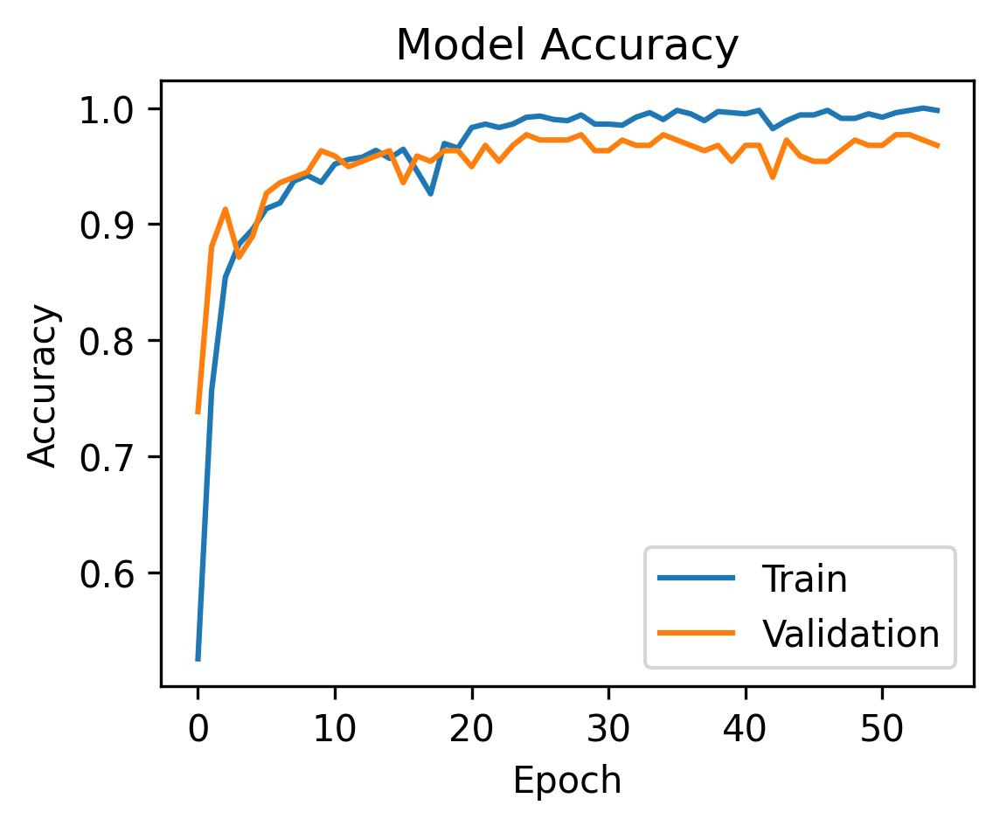
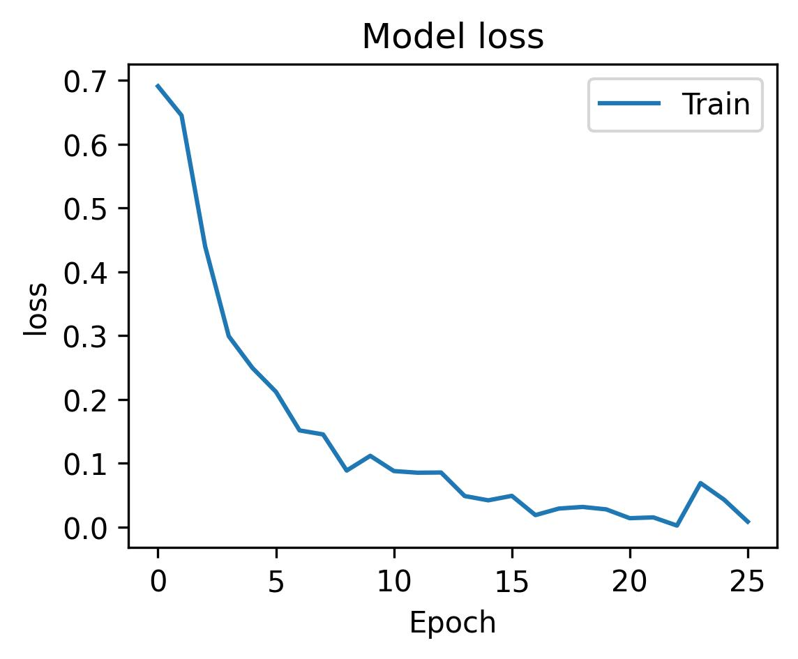

# CNN-Project---Driver-Drowsiness-Detection
This project is a Drowsiness Detection System that uses a Convolutional Neural Network (CNN) and OpenCV to monitor a user's eyes through a webcam and detect signs of drowsiness in real-time.

## Project Description

The system works by:

* Capturing video frames using a webcam via OpenCV
* Detecting the eyes using Haar cascades
* Classifying whether eyes are open or closed using a trained CNN model
* Raising an alert (e.g., sound) if drowsiness is detected over consecutive frames

## File structure 
* `support_files/`  
    - `Alert.mp3`  
    - `my_right_eye.jpg`  
    - `my_left_eye.jpg`  
    - `closed_eye.jpg`

* `Driver_Drowsiness_integrated.py` -> Main file to run the application 
* `Driver_Drowsiness_CNN.ipynb` -> File to train a CNN model 
* `image_data_processing.ipynb` -> File to preprocess your trainig data 

## CNN Model

The Convolutional Neural Network (implemented in `Driver_Drowsiness_CNN.ipynb`) is trained to classify eye states:

* **Open**
* **Closed**

It includes:

* Convolutional and MaxPooling layers
* Dropout for regularization
* Dense output layer for binary classification

**It achieved an accuracy of around 96% on the test data**
<div align="center">
  
  
</div>

##  Drowsiness Detection Logic

Implemented in `Driver_Drowsiness_integrated.ipynb`:

* Streams webcam frames via OpenCV
* Detects eye regions using Haar cascade classifier
* Passes preprocessed eyes into the CNN model
* Counts closed-eye frames, and if they cross a threshold, plays a warning sound

## Requirements
Key packages:

* `opencv-python`
* `tensorflow`
* `keras`
* `matplotlib`, `numpy`, `pandas`
* `pygame`, `playsound`

# How To Run 
1. **Preprocess your data**:

    Open and run:

```bash
image_data_processing.ipynb
```
2. **Train the CNN model**:

    Open and run:

```bash
Driver_Drowsiness_CNN.ipynb
```

3. **Start the Drowsiness Detection App**:

    Run:

```bash
Driver_Drowsiness_integrated.py
```
> This starts the webcam and begins monitoring eye activity.

>If the eyes are classified as closed for too many consecutive frames, an alarm will sound via `playsound`.

### This project has been a learning experience on CNN and OpenCV 
### Source of data set [Kaggle.com](https://www.kaggle.com/datasets/dheerajperumandla/drowsiness-dataset?resource=download)